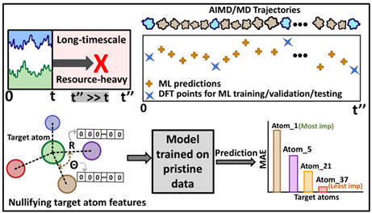

# CdSe-QDs-GNN-Framework

Machine learning framework for predicting time-resolved electronic properties in ligand-passivated CdSe quantum dots (Cd28Se17X22, X = Cl, OH). This repository includes AIMD trajectories, DFT-calculated electronic properties, and graph-based neural network models (ALIGNN and CGCNN), along with atom-specific importance analyses via Feature Nullification Analysis (FNA). Developed for studying bandgap and subgap fluctuations over extended trajectories using transfer learning and minimal DFT sampling.

