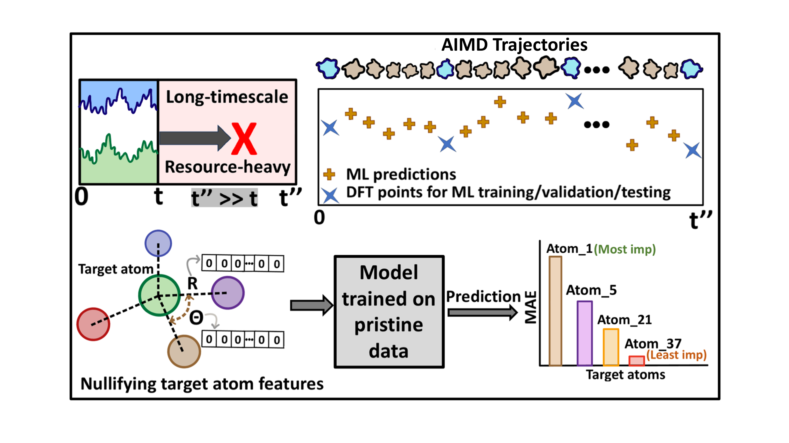

# CdSe-QDs-GNN-Framework
<p align="justify">
Machine learning framework for predicting time-resolved electronic properties in ligand-passivated CdSe quantum dots (Cd<sub>28</sub>Se<sub>17</sub>X<sub>22</sub>, X = Cl, OH). This repository includes AIMD trajectories, DFT-calculated electronic properties, and graph-based neural network models (ALIGNN and CGCNN), along with atom-specific importance analyses via Feature Nullification Analysis (FNA). Developed for studying bandgap and subgap fluctuations over extended trajectories using transfer learning and minimal DFT sampling.



### Full AIMD trajectories (30 000 files)

To keep this repository small, the **complete** 10 ps trajectories are **not**
stored in Git.  Download the tar archives from the *Releases* tab:

| System | Release asset | Size |
|--------|---------------|------|
| Cd₂₈Se₁₇Cl₂₂ | [`Cd28Se17Cl22_15000_vasp.tar.gz`](https://github.com/kushalsamanta/cdse-qds-gnn-framework/releases/download/v1.0-data/Cd28Se17Cl22_15000_vasp.tar.gz) | 20 MB |
| Cd₂₈Se₁₇(OH)₂₂ | [`Cd28Se17OH22_15000_vasp.tar.gz`](https://github.com/kushalsamanta/cdse-qds-gnn-framework/releases/download/v1.0-data/Cd28Se17OH22_15000_vasp.tar.gz) | 27 MB |

```bash
# Example: fetch the Cl‑passivated set
curl -L -O \
  https://github.com/kushalsamanta/cdse-qds-gnn-framework/releases/download/v1.0-data/Cd28Se17Cl22_15000_vasp.tar.gz

tar -xzf Cd28Se17Cl22_15000_vasp.tar.gz -C data/structures


---

## What’s inside 📂
| Folder | Contents |
|--------|----------|
| `src/` | Training & inference scripts for **ALIGNN** and **CGCNN** |
| `assets/` | Figures (framework overview, key results) |
| `data/` | Small demo trajectory + DFT labels (full datasets on Zenodo) |
| `notebooks/` | Reproduce the paper’s parity plots and time‑series |
| `tests/` | Minimal pytest suite for CI |

---

</p>
