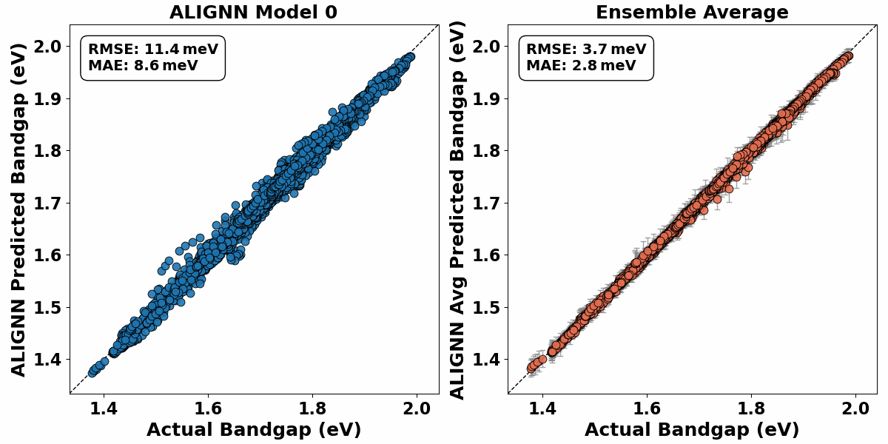

# CdSe-QDs-GNN-Framework

Machine learning framework for predicting time-resolved electronic properties in ligand-passivated CdSe quantum dots (Cd28Se17X22, X = Cl, OH). This repository includes AIMD trajectories, DFT-calculated electronic properties, and graph-based neural network model (ALIGNN), along with atom-specific importance analyses via Feature Nullification Analysis (FNA). Developed for studying bandgap and subgap fluctuations over extended trajectories using transfer learning and minimal DFT sampling.

---

## Structure–property evolution

The short clip below shows how the **Cd28Se17Cl22** core–ligand geometry (left) evolves together with the ensemble‑predicted bandgap trajectory (right) over the first 10 ps of the AIMD simulation, highlighting the structure–property correlations captured by ALIGNN.

---

## Ensemble‑model accuracy 

The animation below compares **parity plots** for every individual ALIGNN model
(run 0 → run 19, left panel) with the **ensemble‑averaged parity plot** (right panel).
A tight 1:1 line on the right demonstrates how averaging 20 models
reduces scatter and delivers band‑gap predictions that closely match DFT.

  

---

## Full AIMD trajectories (30 000 files)

To keep this repository small, the **complete** 15 ps trajectories are **not**
stored in Git.  Download the tar archives from the *Releases* tab:

| System | Release asset | Size |
|--------|---------------|------|
| Cd₂₈Se₁₇Cl₂₂ | [`Cd28Se17Cl22_15000_vasp.tar.gz`](https://github.com/kushalsamanta/cdse-qds-gnn-framework/releases/download/v1.0-data/Cd28Se17Cl22_15000_vasp.tar.gz) | 20 MB |
| Cd₂₈Se₁₇(OH)₂₂ | [`Cd28Se17OH22_15000_vasp.tar.gz`](https://github.com/kushalsamanta/cdse-qds-gnn-framework/releases/download/v1.0-data/Cd28Se17OH22_15000_vasp.tar.gz) | 27 MB |

---
## Zenodo archive (everything in one place)

All numerical artefacts supporting this repository have been deposited on Zenodo:

**https://doi.org/10.5281/zenodo.15359153**

What you’ll find inside the archive (≈ 4.37 GB):

| Category | Contents |
|----------|----------|
| **AIMD data** | 15 ps, 1 fs‑step trajectories for Cd₂₈Se₁₇Cl₂₂(`*.vasp`) |
| **DFT labels** | Bandgap values used for ALIGNN training (`id_prop.csv`) |
| **Ensemble models** | 20 ALIGNN checkpoints (`run_*/temp/checkpoint.pt`, 0 – 10 ps training) |
| **Predictions** | Per‑frame bandgap for 0 – 10 ps (`prediction.csv`) |
| **Atom‑importance** | Feature Nullification outputs for every <em>model × atom</em> (`atom_imp_*`) |
| **Transfer‑learning** | Fine‑tuned checkpoints + predictions for the extended 10 – 15 ps window |
| **SLURM logs & scripts** | All job scripts |

Download the archive to reproduce every figure in the manuscript or to kick‑start your own experiments with pre‑trained models.

---

